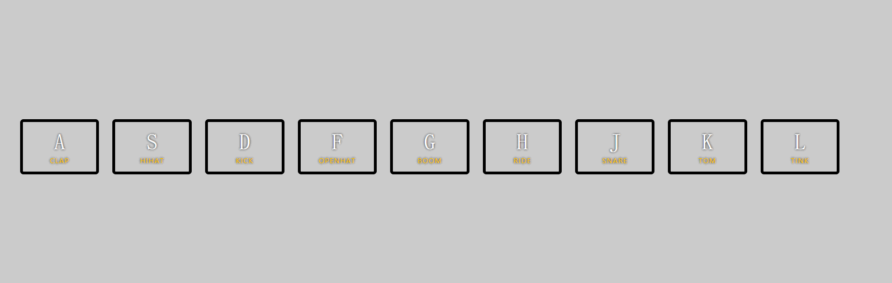
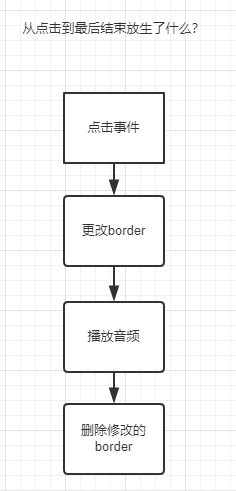

## 主题
    
    使用js键盘按下后播放对应按键的声音，并同时产生特效，在按下其他键的时候，之前的键和音取消

## 脑图



我把这个过程分解成几块，点击，修改，删除

1.  点击：使用keydown事件来监听用户的点击`window.addEventListener('keydown',fun)`。
函数用来处理修改的内容

2.  修改: `fun`函数中用来修改`border`，`播放音频` 这里需要注意的是class，有一个可以单独删除或添加的class。

3.  删除：点击之后删除之前的样式,点击下一个重置audio为0。这里的难点是如何监听动画播放完成？？


## JavaScript语法

### css 部分

1.  transition

>   定义动画速度效果,当我们修改了这个定义了`transition`都会触发这些效果，不论是后加的还是之前有的样式。
[MDN-transition 的属性](https://developer.mozilla.org/zh-CN/docs/Web/CSS/CSS_Transitions/Using_CSS_transitions)

`transition` 有四个属性，分别是`设置过度效果的css属性名称`,`完成过渡效果需要多少秒或毫秒`,`速度效果的速度曲线`,`过渡效果何时开始`。
*   `transition-property`:`none:默认，没有`,`all：所有属性都将获得过渡效果`,`property:定义应用过渡效果的 CSS 属性名称列表，列表以逗号分隔。`
*   `transition-duration`:规定完成过渡效果需要花费的时间（以秒或毫秒计）。默认值是 0，意味着不会有效果。
*   `transition-timing-function`:
    *   linear	规定以相同速度开始至结束的过渡效果（等于 cubic-bezier(0,0,1,1)）。
    *   ease	规定慢速开始，然后变快，然后慢速结束的过渡效果（cubic-bezier(0.25,0.1,0.25,1)）。
    *   ease-in	规定以慢速开始的过渡效果（等于 cubic-bezier(0.42,0,1,1)）。
    *   ease-out	规定以慢速结束的过渡效果（等于 cubic-bezier(0,0,0.58,1)）。
    *   ease-in-out	规定以慢速开始和结束的过渡效果（等于 cubic-bezier(0.42,0,0.58,1)）。
    *   cubic-bezier(n,n,n,n)	在 cubic-bezier 函数中定义自己的值。可能的值是 0 至 1 之间的数值。

*   `transition-delay`:规定在过渡效果开始之前需要等待的时间，以秒或毫秒计。

2.  transform
>   定义转换放大缩小，2d/3d效果
[transform 属性](http://www.w3school.com.cn/cssref/pr_transform.asp)

### js 部分

#### element.classList

范例中使用`add()`和`remove()`，它还有其他的用法
```
classList.add('aaa','bbb','ccc');//新增多个className
classList.remove('aaa','bbb','ccc');//移除多个className/如果不存在className则会被忽略
```
还有其他方法
>   `toggle()`是否存在这个className,存在则删除/不存在则新增  /*可以说相当好用，想起当年jq撸翻一切的年代*/
>   `contains()`是否存在这个className，返回 true/false
[参考](https://developer.mozilla.org/en-US/docs/Web/API/Element/classList)

#### element.querySelectorAll/querySelector

范例中使用了`querySelector/querySelectorAll`这个方法，与`jq`中的方法很像，不过querySelector更完善一些，
找id，找class，找属性，过滤。
```
document.querySelector('#foo') // "#foo"
document.querySelector('.foo') // ".foo"
document.querySelectorAll(data-key]) // 返回所有属性带data-key的 元素 
document.querySelector(data-key]) // 返回第一个包含data-key属性的元素

css中也可以设置这些样式

<div class="foo" data-name="i">foo</div>
<div class="foo" data-name="ii">foo</div>

css 代码

.foop[data-name='i']{code}
.foop[data-name='ii']{code}
```
[data-*](http://www.css88.com/archives/4715)
[MDN-querySelector](https://developer.mozilla.org/zh-CN/docs/Web/API/Document/querySelector)


#### Array.from

范例中有这么一段`const keys = Array.from(document.querySelectorAll('.key'));`

查询之后才知道`Array.from`从一个类似数组或可迭代对象中创建一个新的数组实例。
这里有个问题，querySelectorAll返回的是nodelist跟Array是不同的。
虽然很像迭代对象，但是nodeList并没有arr.prototype上的方法！

通过`array.push()`去测试，会发现用`querySelectorAll`得到的结果都无法`push`；

```
let testNodeList = document.querySelectAll('.key');
testNodeList.push('add'); // <--非迭代对象报错TypeError: testNodeList.push is not a function

let testArray = Array.from(testNodeList);
testArray.push('add'); // <-- 转换为迭代对象就可以了

```
[MDN-nodeList](https://developer.mozilla.org/en-US/docs/Web/API/NodeList)

#### event.transitionend

`transitionend 事件会在 CSS transition 结束后触发. 当transition完成前移除transition时，比如移除css的transition-property 属性，事件将不会被触发.如在transition完成前设置  display 为"none"，事件同样不会被触发。`

范例中是这样的
```
keys.forEach(key => key.addEventListener('transitionend',removeClass))

window.addEventListener('keydown',playSound)

```
当我们触发`keydown`的时候，通过一系列事件给元素添加动画效果，这个时候我们forEach监听就能监听到这个属性。

```
//删除样式
function removeClass(e){
    if (e.propertyName !== 'transform') return;
    e.target.classList.remove('playing');
}
```

返回的event中 有一个属性 `propertyName` 当事件结束后会触发他们的属性名称，我们用这个方法来判断是否已经结束动画。
然后通过e.target.classList.remove('css') 删除这个样式

`e.target`：DOM对象


[event](https://developer.mozilla.org/zh-CN/docs/Web/Events)
[event-transitionend](https://developer.mozilla.org/zh-CN/docs/Web/Events/transitionend)

## 探索

使用鼠标来点击达成按键一样的效果。

在`keys.forEach(key => key.addEventListener('transitionend',removeClass))`上面加上点击事件
`keys.forEach(key => key.addEventListener('click',playSound))`;

然后在playSound 函数中获取 当前点击的dom 的data-key的值
`this.getAttribute('data-key')`
修改之后代码
```
let code = event.keyCode || this.getAttribute('data-key');
const key = document.querySelector(`div[data-key="${code}"]`)
//如果key为空 return
if(!key) return
const audio = document.querySelector(`audio[data-key="${code}"]`)

```

放在github上的时候发现加载音频特别慢(ps:可能是我本地的网络问题);

尝试几种方式来解决这个问题。

通过代码的放是来解决:

1.  加一个loading等资源加载完成？！ 不行，其他的资源都加载完成了难道要所有资源都等这个一个死资源？？
2.  整个页面需要加载的资源有css ， audio 这两种，先判断css是否加载完成，或判断audio是否加载完成。这样的做法就是代码量增加。还是没有解决这个问题。

`我们能做的是尽量让用户无感知资源加载，用户从打开到使用就一个字快。`

第二种方式修改一下，通过缓存的方式，用户第一次打开进行缓存存储。其实这种方式还没有解决加载慢的问题。

3.  微博存储。通过url的方式链接，微博的url都是经过加速的。或者七牛cdn存储。本质上是通过第三方来加载资源。

目前想到的办法就这些，有的话我回头在来更新。
