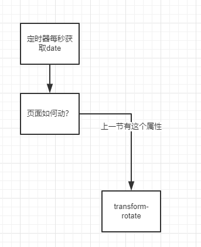

## 主题
    
    用js和css制作一个时钟

## 脑图



js方面:设置一个定时器就完成了，然后每秒更新时分秒的角度就ok了。
css：主要还是使用`css3`的`transform`部分

## JavaScript语法

### css 部分

范例中有一段css代码。
```
transform-origin: 100%;  设置hand以原点进行旋转
transform: rotate(90deg); 设置从12点开始进行旋转 0 度是 3点

```

## 探索

这里有个问题，当旋转更新为0的时候，会闪一下。
后来发现，因为使用了`transtion`,在角度切换时会加上动画效果。
354 ==》 0 会被认为是往前，不是转一圈回到起点，所以动画先转到0度，然后在到90度。

解决办法:

去除css中 hand 动画 /* transition: all 0.05s; */

在js中加上一段判断

```
function setRotate(deg) {
    if (deg === 90 || deg === 116.5) {
        document.querySelector('.hand').style.transition = 'all 0s';
    } else {
        document.querySelector('.hand').style.transition = 'al0.05s';
    }
    return `rotate(${deg}deg)`;
}

```