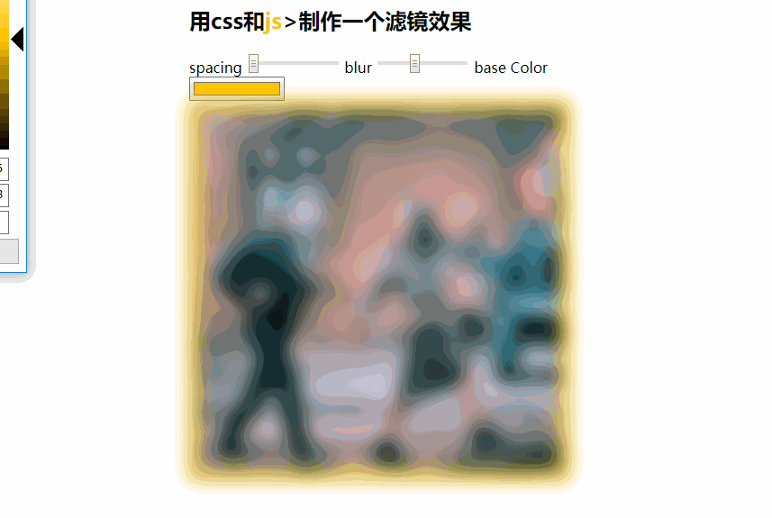

## 主题
    
    用js和css制作一个滤镜效果

## 脑图

以前从来没做过这种，不知道如何下手，看了范例的代码构思很巧妙

1.  布局

使用`input`控制`img`的方式，属性`range`类似进度条的方式。然后设置`input`的data-*属性来判断是否需要'px'单位

举例
```
    <input type="range" name="spacing" min="10" max="200" value="10" data-sizing="px">

```

## JavaScript语法

### css 部分

1.  filter:CSS滤镜（filter）属提供的图形特效，像模糊，锐化或元素变色。过滤器通常被用于调整图片，背景和边界的渲染。

2.  范例中有一段css代码。
```
:root {
    --base: #ffc600;
    --spacing: 10px;
    --blur: 10px;
}

```
`:root`：这个 CSS 伪类匹配文档树的根元素。对于 HTML 来说，:root 表示 <html> 元素，除了优先级更高之外，与 html 选择器相同。

3.  `--xxx:#ffc600`:css变量，使用的时候用 `var(--xxx)`调用

范例中有一段
```
const suffix = this.dataset.sizing || '';

```

4. `data-*`:在js中获取data中的值可以使用`this.dataset`，它会获取到元素上面所有`data`的属性以及`value`的值

[:root-MDN](https://developer.mozilla.org/zh-CN/docs/Web/CSS/:root)
[css变量var(---xxx) -MDN](https://developer.mozilla.org/zh-CN/docs/Web/CSS/Using_CSS_variables)

[filter-MDN](https://developer.mozilla.org/zh-CN/docs/Web/CSS/filter)

### js部分

`CSSStyleDeclaration.setProperty()`方法接口为一个声明了CSS样式的对象设置一个新的值 。
与直接设置`style`相同，书写的方式不同罢了。
```
var declaration = document.styleSheets[0].rules[0].style;
declaration.setProperty('margin', '1px 2px');  //跟下面一段相同
declaration.style.margin = '1px 2px';
```

[setProperty-MDN](https://developer.mozilla.org/zh-CN/docs/Web/API/CSSStyleDeclaration/setProperty)

## 探索

filte滤镜提供了一些图形特效，如高斯模糊、锐化、变色等。尝试加一些效果上面