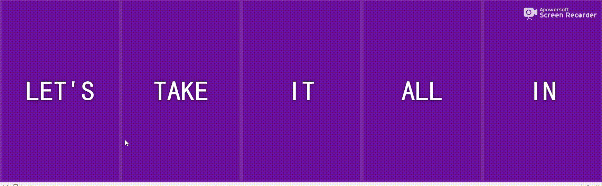

## 主题
    
    用js和css制作一个点击的动画效果

## 步骤

做之前看了成品，使用css3的一些属性就可以完成，只要添加删除css的属性就可以了

1.  布局

主要使用`flex`,`transition`和`transform`。
通常情况下我都是参考阮一峰的flex 教程来编写css
常用使用方法是在外容器`panels`设置`display:flex`

panel添加：

    子容器`panel`加上`flex:1`让每个子元素平均分

    `justify-content: center` 水平居中

    `flex-direction：column` 主轴的方向，从左往右

    在加上一层`display: flex`为了panel的子元素也变成flex

动画有一个顺序的问题。先触发添加`open`完毕之后触发`open-active`所以就要监听`.open`的`propertyName`触发顺序，监听到`flex`之后再触发下面

`classList`再第一张遇到过`add`,`remove`。
`toggle`:当只有一个参数时，切换 class value; 即如果类存在，则删除它并返回false，如果不存在，则添加它并返回true。

监听`transitionend`事件是否触发，运行添加/删除`open-active`

## 探索

实现点击其他关闭效果。

-   通过element进行判断，当前是不是父集，如果不是，删除`open`，然后把当前赋值给父集。

```
if(this !== lastClickPanel){
    lastClickPanel.classList.remove('open');
    lastClickPanel = this; 
}

```